

  

<h1 align="center">NumPlay</h1>

  <b>14 free games for your NumWorks calculator, in one app.</b> 
  NumDash, Crossy Road, NumDrive, Tetris, Chess, Flappy Bird, Pac-Man, Snake, Connect Four, Solitaire, NumDance, 2048, Minesweeper and Breakout, plus NumVisuals: moving backgrounds with a clock, a timer and more.

  

  <a href="#how-to-install"><b>How to install</b></a> &nbsp;·&nbsp; <a href="docs/play.md"><b>How to play</b></a>

  Open to game requests! Email me at <a href="mailto:masonchen204@gmail.com">masonchen204@gmail.com</a>.

  

## Download

Click a file to download it. Not sure which one? Take the first.

<table>
  <tr>
    <td width="120" align="center"></td>
    <td><b><a href="https://github.com/Mason363/NumPlay/releases/latest/download/NumPlay.nwa">NumPlay.nwa</a></b> <b>All 14 games and NumVisuals in one app. Start here!</b></td>
  </tr>
  <tr>
    <td width="120" align="center"></td>
    <td><a href="https://github.com/Mason363/NumPlay/releases/latest/download/NumPlay-Invisible.nwa">NumPlay-Invisible.nwa</a> The same app, hidden. Its icon is plain white, like the calculator's home screen, and it has no name, so it looks like an empty spot.</td>
  </tr>
  <tr>
    <td width="120" align="center"></td>
    <td><a href="https://github.com/Mason363/NumPlay/releases/latest/download/NumPlay-Matrices.nwa">NumPlay-Matrices.nwa</a> The same app, in disguise. It looks like a math app called <b>Matrices</b>, next to the calculator's own apps.</td>
  </tr>
  <tr>
    <td></td>
    <td>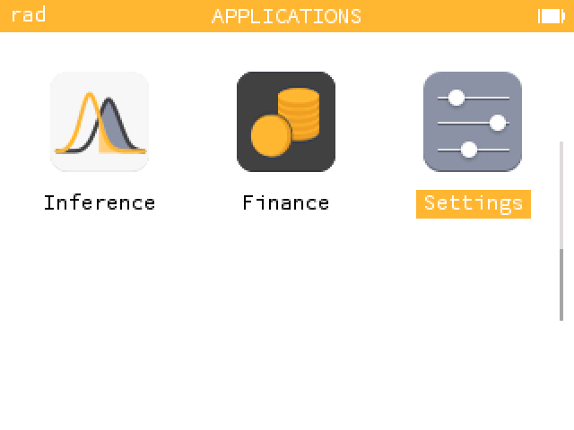 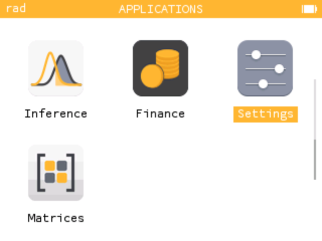 On the home screen: the invisible one is really there, in the empty spot after Settings. The Matrices one sits among the calculator's own apps.</td>
  </tr>
  <tr>
    <td width="120" align="center">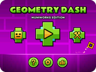</td>
    <td><a href="https://github.com/Mason363/NumPlay/releases/latest/download/NumDash.nwa">NumDash.nwa</a> Only NumDash: jump to the beat</td>
  </tr>
  <tr>
    <td width="120" align="center">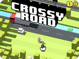</td>
    <td><a href="https://github.com/Mason363/NumPlay/releases/latest/download/CrossyRoad.nwa">CrossyRoad.nwa</a> Only Crossy Road: hop, dodge, survive</td>
  </tr>
  <tr>
    <td width="120" align="center">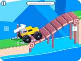</td>
    <td><a href="https://github.com/Mason363/NumPlay/releases/latest/download/NumDrive.nwa">NumDrive.nwa</a> Only NumDrive: drive, flip, finish</td>
  </tr>
  <tr>
    <td width="120" align="center">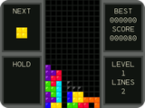</td>
    <td><a href="https://github.com/Mason363/NumPlay/releases/latest/download/Tetris.nwa">Tetris.nwa</a> Only Tetris: stack and clear lines</td>
  </tr>
  <tr>
    <td width="120" align="center">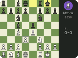</td>
    <td><a href="https://github.com/Mason363/NumPlay/releases/latest/download/NumChess.nwa">NumChess.nwa</a> Only Chess: bots, puzzles, 2 players</td>
  </tr>
  <tr>
    <td width="120" align="center">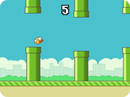</td>
    <td><a href="https://github.com/Mason363/NumPlay/releases/latest/download/FlappyBird.nwa">FlappyBird.nwa</a> Only Flappy Bird: flap through the pipes</td>
  </tr>
  <tr>
    <td width="120" align="center">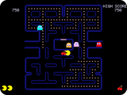</td>
    <td><a href="https://github.com/Mason363/NumPlay/releases/latest/download/PacMan.nwa">PacMan.nwa</a> Only Pac-Man: eat dots, dodge ghosts</td>
  </tr>
  <tr>
    <td width="120" align="center">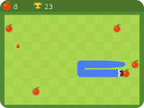</td>
    <td><a href="https://github.com/Mason363/NumPlay/releases/latest/download/Snake.nwa">Snake.nwa</a> Only Snake: eat apples, grow long</td>
  </tr>
  <tr>
    <td width="120" align="center">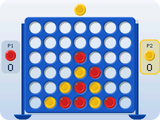</td>
    <td><a href="https://github.com/Mason363/NumPlay/releases/latest/download/ConnectFour.nwa">ConnectFour.nwa</a> Only Connect Four: four in a row wins, against a friend or the computer</td>
  </tr>
  <tr>
    <td width="120" align="center">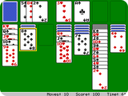</td>
    <td><a href="https://github.com/Mason363/NumPlay/releases/latest/download/Solitaire.nwa">Solitaire.nwa</a> Only Solitaire: the classic card game</td>
  </tr>
  <tr>
    <td width="120" align="center">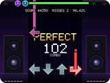</td>
    <td><a href="https://github.com/Mason363/NumPlay/releases/latest/download/NumDance.nwa">NumDance.nwa</a> Only NumDance: hit the arrows on the beat</td>
  </tr>
  <tr>
    <td width="120" align="center">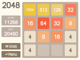</td>
    <td><a href="https://github.com/Mason363/NumPlay/releases/latest/download/2048.nwa">2048.nwa</a> Only 2048: slide, merge, reach 2048</td>
  </tr>
  <tr>
    <td width="120" align="center">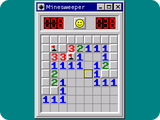</td>
    <td><a href="https://github.com/Mason363/NumPlay/releases/latest/download/Minesweeper.nwa">Minesweeper.nwa</a> Only Minesweeper: clear the field, flag the mines</td>
  </tr>
  <tr>
    <td width="120" align="center">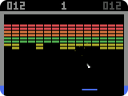</td>
    <td><a href="https://github.com/Mason363/NumPlay/releases/latest/download/Breakout.nwa">Breakout.nwa</a> Only Breakout: break every brick</td>
  </tr>
  <tr>
    <td width="120" align="center"></td>
    <td><a href="https://github.com/Mason363/NumPlay/releases/latest/download/NumVisuals.nwa">NumVisuals.nwa</a> Only NumVisuals: backgrounds, clocks, timers</td>
  </tr>
</table>

The first three are the same app with the same games: only the icon and the name change. Your progress is saved on the calculator either way.

## How to install

You need your calculator, its USB cable, and a computer with **Google Chrome** or **Microsoft Edge**. It takes about 2 minutes.

1. **Download** a file from the table above. It goes to your Downloads folder.
2. **Plug** your calculator into the computer and turn it on.
3. **Go to** [my.numworks.com/apps](https://my.numworks.com/apps) and log in. No account? Sign up there, it's free.
4. Click **Connect**, then pick your calculator in the small window that opens.
5. **Add** the file you downloaded, then click **Install**. Keep the calculator plugged in until it's done.
6. **Play!** On your calculator, press the **Home** key (the little house), go to the end of the apps and open **NumPlay**.

> [!TIP]
> **Updating?** Install the new file the same way. Your progress comes back by itself: NumPlay keeps a copy of it in a Python script called `numplay_saves.py`, the one kind of file the website keeps. (This works for updates from version 1.2.1 on.)
>
> Already have other apps from that website? It swaps them for the new ones, so add them again in step 5 to keep them. The calculator's own apps are never touched.
>
> Nothing happens when you plug it in? Try another cable: some only charge.

## Gameplay

<table>
  <tr>
    <td></td>
    <td></td>
  </tr>
  <tr>
    <td></td>
    <td></td>
  </tr>
  <tr>
    <td></td>
    <td>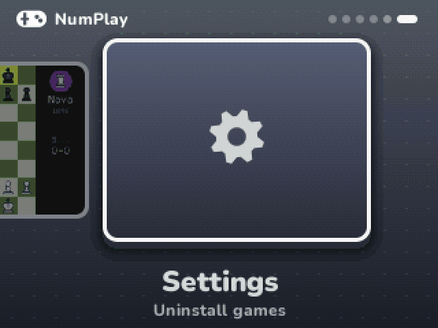</td>
  </tr>
  <tr>
    <td>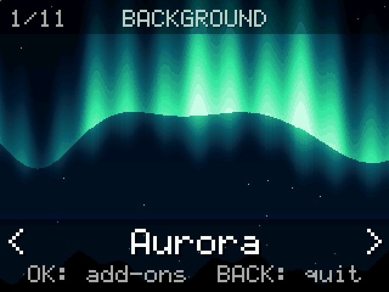</td>
    <td>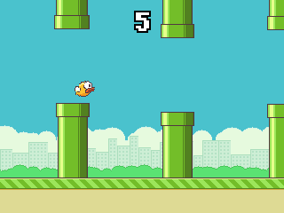</td>
  </tr>
  <tr>
    <td>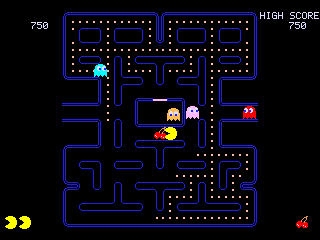</td>
    <td>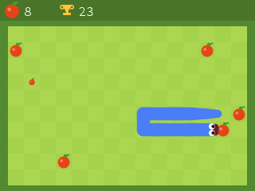</td>
  </tr>
  <tr>
    <td>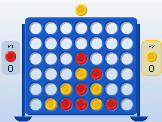</td>
    <td></td>
  </tr>
  <tr>
    <td>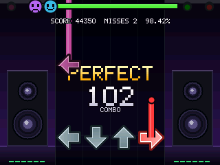</td>
    <td>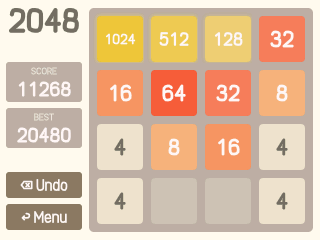</td>
  </tr>
  <tr>
    <td></td>
    <td>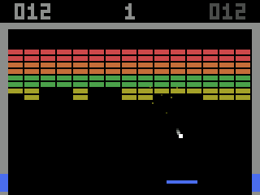</td>
  </tr>
</table>

## Acknowledgements

- **[Tatone26](https://github.com/Tatone26/Numworks-games)** made Tetris and **All the Apps**, and released them into the public domain. NumPlay's Flappy Bird, Pac-Man, Snake, Connect Four and Solitaire are rewritten in C from All the Apps and keep its options, and our 2048 started from Tatone26's Python version.
- **[Gabriele Cirulli](https://github.com/gabrielecirulli/2048)** made 2048.
- **[gd3ds](https://github.com/AleFunky/gd3ds)** by AleFunky and friends, whose research into Geometry Dash made NumDash possible.
- The **Nunito** and **Rammetto One** fonts, under the SIL Open Font License ([LICENSES](LICENSES)).

Unofficial fan games, not affiliated with NumWorks, RobTop Games (Geometry Dash), Hipster Whale (Crossy Road), the makers of Drive Mad, .GEARS (Flappy Bird), Bandai Namco (Pac-Man), Hasbro (Connect Four), Atari (Breakout) or Microsoft (Solitaire, Minesweeper). Tetris is a trademark of The Tetris Company, Pac-Man of Bandai Namco, Connect Four of Hasbro and Breakout of Atari.
