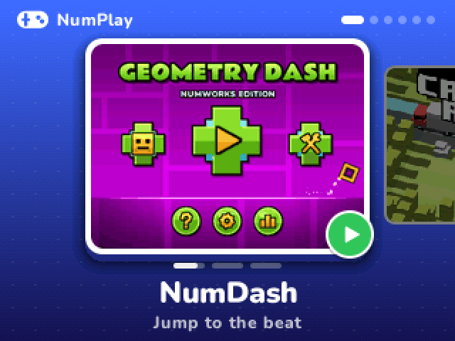

# How to install NumPlay

You need your NumWorks calculator, its USB cable, and a computer with **Chrome** or **Edge**.

1. **Download** [NumPlay.nwa](https://github.com/Mason363/NumPlay/releases/latest/download/NumPlay.nwa).
2. **Plug** your calculator into the computer.
3. **Open** [my.numworks.com/apps](https://my.numworks.com/apps), add `NumPlay.nwa` and follow the steps.
4. **Play**: press the Home key and open **NumPlay**, at the end of the list of apps.

## Good to know

- **Other apps.** The website installs every app you add in one go. If you also use other apps, add them in the same step as NumPlay.
- **One game only?** Every game is also available on its own, from the [latest release](https://github.com/Mason363/NumPlay/releases/latest): `NumDash.nwa`, `CrossyRoad.nwa`, `NumDrive.nwa`, `Tetris.nwa` and `NumChess.nwa`. Install them the same way.
- **Space.** NumPlay takes about 550 KB, less than installing the five games one by one. To free space, open the **Settings** card in NumPlay and uninstall the games you don't play.
- **Your progress** is saved on the calculator, in the same files whether you play a game in NumPlay or on its own.
- Made for the **NumWorks N0120**. Keep your calculator's software up to date on [my.numworks.com](https://my.numworks.com).

Next: [how to play](play.md).
