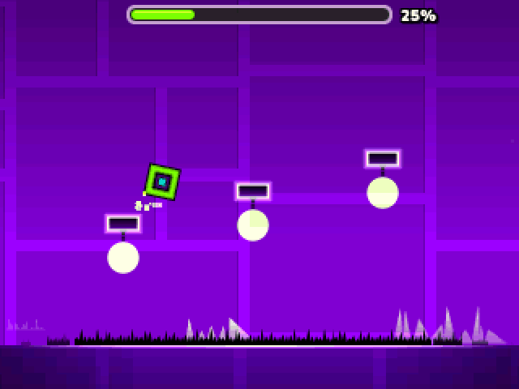
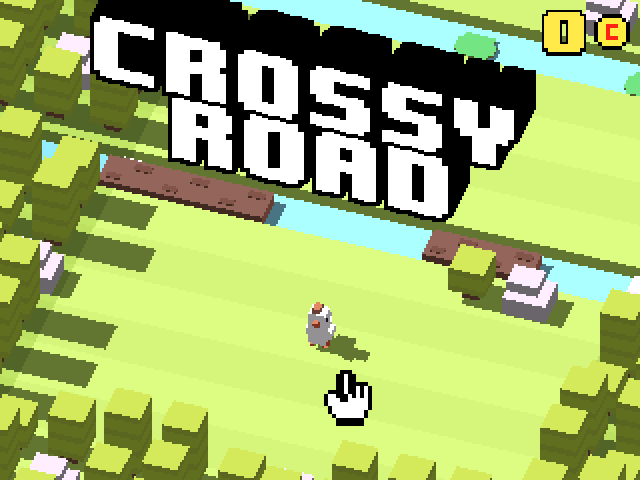
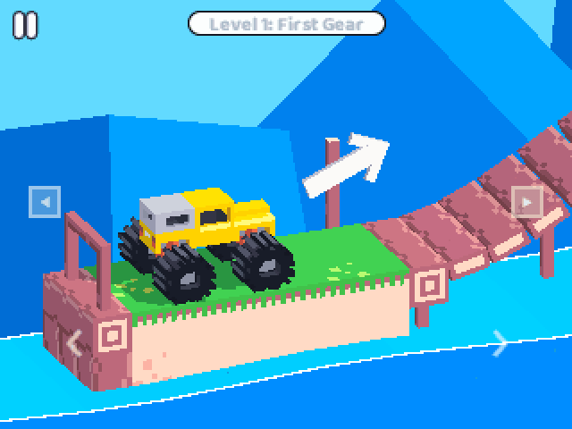
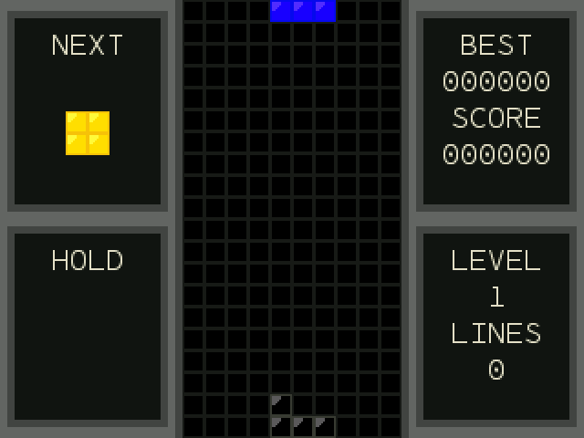
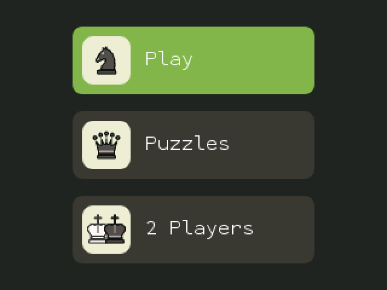

# How to play

## NumPlay

| Key | What it does |
| --- | --- |
| **Left / Right** (or 4 / 6) | Pick a game |
| **OK** or **EXE** (or 5) | Play |
| **Back** | Leave a game's main menu to come back here. On the carousel, quit NumPlay |
| **Home** | Quit, from anywhere |

The last card, **Settings**, can:

- **Reset** a game's progress, or every game's at once (it asks first; levels you made are kept)
- **Uninstall** the games you don't play, to free up space
- **Start as Matrices**: NumPlay opens as a plain matrix calculator. Your secret way in opens the games: pick the x,n,t key, var, Toolbox, π, √, or *Examples* in the Toolbox menu

In every game, **Back** pauses, and the pause menu has a small **Quit game** button. It always asks first, since Back sits right next to OK.

## NumDash

| Key | What it does |
| --- | --- |
| **OK**, **EXE** or **Up** | Jump. Hold to keep jumping, fly the ship up, or flip the ball's gravity |
| **Back** | Pause, or go back in menus |
| **0** | Place a checkpoint (practice mode) |
| **⌫** | Remove your last checkpoint |

Nine levels, from Stereo Madness to Time Machine and Cycles. The **?** button on the main menu shows every key. In the level editor, **KEYS** on the My Levels screen draws the keyboard with what each key does (it also shows the first time you open the editor).

 

## Crossy Road

| Key | What it does |
| --- | --- |
| **Up**, **OK** or **EXE** | Hop forward |
| **Left / Right / Down** | Hop sideways or back |
| **Back** | Pause (then Quit game) |

Keep moving, or the eagle gets you. Coins add up across every run and stay saved.

 

## NumDrive

| Key | What it does |
| --- | --- |
| **Right** | Drive forward |
| **Left** | Brake and reverse |
| **OK** or **Back** | Pause. **Back** again resumes |
| **Levels** on the pause card | Pick any level |

Don't floor it the whole way: too much gas flips the car.

 

## Tetris

| Key | What it does |
| --- | --- |
| **Left / Right** (or 4 / 6) | Move |
| **Down** (or 2) | Soft drop |
| **Up** (or 8) | Hard drop |
| **OK** | Rotate |
| **Toolbox** | Rotate the other way |
| **⌫** | Hold the piece |
| **Back** | Pause (then Quit game) |

 

## Chess

| Key | What it does |
| --- | --- |
| **Arrows** | Move the cursor |
| **OK** or **EXE** | Pick a piece, then its move |
| **Back** | Deselect, pause menu (with Quit game), or back |
| **⌫** | Undo |

12 bots from 150 to 2100 Elo, endless puzzles, and a two-player clock.

 
