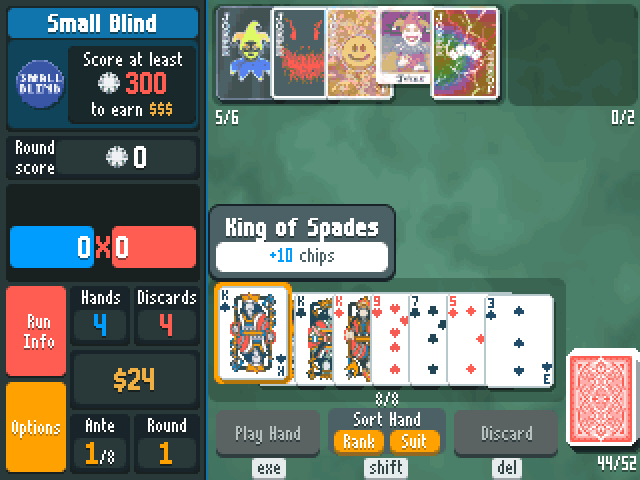
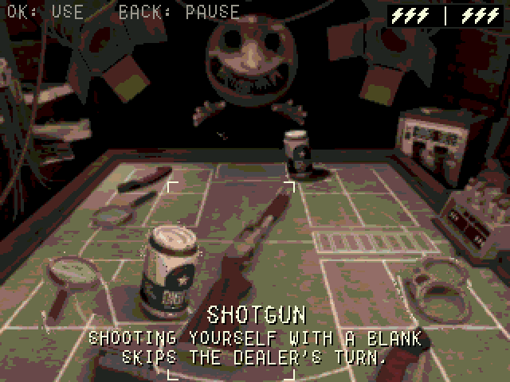
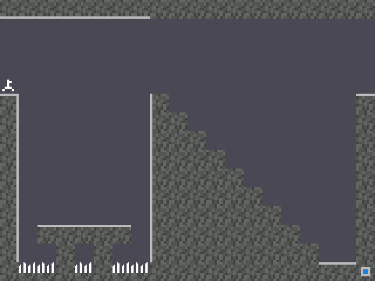

# How to play

## NumPlay

| Key | What it does |
| --- | --- |
| **Left / Right** (or 4 / 6) | Pick a game |
| **OK** or **EXE** (or 5) | Play |
| **Back** | Leave a game's main menu to come back here. On the carousel, quit NumPlay |
| **Home** | Quit, from anywhere |

The last card, **Settings**, uninstalls the games you don't play, to free up space.

## NumDash

| Key | What it does |
| --- | --- |
| **OK**, **EXE** or **Up** | Jump. Hold to keep jumping, or to fly the ship up |
| **Back** | Pause, or go back in menus |
| **0** | Place a checkpoint (practice mode) |
| **⌫** | Remove your last checkpoint |

The **?** button on the main menu shows every key, including the level editor's.

 

## Crossy Road

| Key | What it does |
| --- | --- |
| **Up**, **OK** or **EXE** | Hop forward |
| **Left / Right / Down** | Hop sideways or back |
| **Back** | Pause |

Keep moving, or the eagle gets you.

 

## NumDrive

| Key | What it does |
| --- | --- |
| **Right** | Drive forward |
| **Left** | Brake and reverse |
| **OK** or **Back** | Pause |
| **Back** on a card | Level list (Back again to leave) |

Don't floor it the whole way: too much gas flips the car.

 

## Balatro

| Key | What it does |
| --- | --- |
| **Arrows** | Move between cards, Jokers and buttons |
| **OK** | Pick a card, or open a Joker or shop item (Buy, Sell, Use) |
| **EXE** | Play hand |
| **⌫** | Discard |
| **Shift** | Sort by rank or suit |
| **Alpha + Left / Right** | Move a Joker or a card |
| **Toolbox** / **Var** | Run info / your deck |
| **Back** | Options |

Hold **OK** or **EXE** to speed up the scoring.

 

## Buckshot Roulette

| Key | What it does |
| --- | --- |
| **Arrows** | Move between your items and the shotgun. Go up to read the Dealer's items |
| **OK** or **EXE** | Use an item, pick up the shotgun, fire |
| **Up / Down** | With the shotgun: aim at the Dealer / at yourself |
| **Letter keys** | Sign the waiver (EXE signs) |
| **Back** | Pause |

Shooting yourself with a blank keeps your turn.

 

## Portal Returns

| Key | What it does |
| --- | --- |
| **Left / Right** | Run |
| **Up** | Jump |
| **1 to 9** (not 5) | Fire a portal that way: 7 is up left, 3 is down right |
| **5** | Switch the color of the next portal |
| **OK** or **EXE** | Pick up or drop a cube, continue |
| **Back** | Pause |

**Help** on the title screen shows every key and every test element.

 

## Tetris

| Key | What it does |
| --- | --- |
| **Left / Right** (or 4 / 6) | Move |
| **Down** (or 2) | Soft drop |
| **Up** (or 8) | Hard drop |
| **OK / Back** | Rotate |
| **⌫** | Hold the piece |
| **Shift** | Pause |

 

## Chess

| Key | What it does |
| --- | --- |
| **Arrows** | Move the cursor |
| **OK** or **EXE** | Pick a piece, then its move |
| **Back** | Deselect, pause menu, or back |
| **⌫** | Undo |

12 bots from 150 to 2100 Elo, endless puzzles, and a two-player clock.

 
