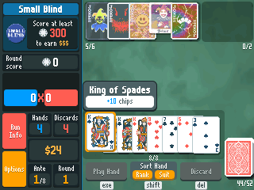
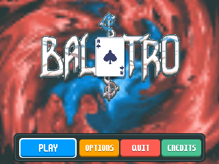
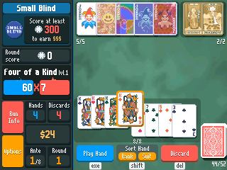
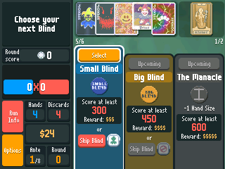
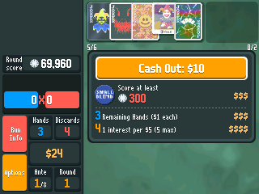
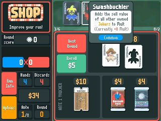
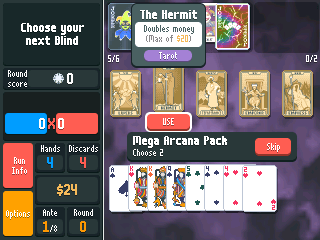

> **Balatro is part of [NumPlay](../../README.md)**, every NumWorks game in one app. Get it with all the others, or on its own as `Balatro.nwa` from the [latest release](https://github.com/Mason363/NumPlay/releases/latest).

<p align="center">
  
</p>

<h1 align="center">Balatro</h1>

<p align="center">
  <b>The poker roguelike, on the NumWorks N0120 calculator.</b><br>
  Play poker hands, build a deck of Jokers and beat the Boss Blind of Ante 8.
</p>

<p align="center">
  <a href="https://github.com/Mason363/NumPlay/releases/latest/download/Balatro.nwa"><b>Download Balatro.nwa</b></a>
  &nbsp;·&nbsp; <a href="#controls">Controls</a>
  &nbsp;·&nbsp; <a href="#credits">Credits</a>
</p>

<p align="center">
  
</p>

## Highlights

* **The whole core game:** Small, Big and Boss Blinds, the shop, booster packs, skip tags and Endless mode after Ante 8.
* **All 150 Jokers**, including the Legendary ones from The Soul, plus every Tarot, Planet and Spectral card, all 32 Vouchers and 24 Tags.
* **All 28 Boss Blinds**, with their own colours and effects, and the five final bosses.
* **Scoring like the original:** cards score left to right, then held cards, then Jokers, with retriggers, editions and seals, and every chip and mult popping up.
* **The look of the game:** the original card and Joker art, the moving paint background, the same panels, colours and font, the fire behind a hand that beats the Blind, and the foil, holographic, polychrome and negative sheens.
* **Saves everything:** press Home at any moment and pick your run back up exactly where you left it.
* Red Deck, White Stake.

<table>
  <tr>
    <td align="center"><br><sub>Title screen</sub></td>
    <td align="center"><br><sub>Pick up to 5 cards and play them</sub></td>
  </tr>
  <tr>
    <td align="center"><br><sub>Play each Blind, or skip it for a Tag</sub></td>
    <td align="center"><br><sub>Cash out: reward, hands left, Jokers, interest</sub></td>
  </tr>
  <tr>
    <td align="center"><br><sub>The shop: Jokers, cards, Vouchers and packs</sub></td>
    <td align="center"><br><sub>A Mega Arcana Pack: use Tarots on your hand</sub></td>
  </tr>
</table>

## Controls

| Key | Action |
|---|---|
| Arrows | Move between cards, Jokers and buttons |
| OK | Select a card, or pick a Joker or item (then Sell, Use, Buy, Open...) |
| EXE | Play Hand |
| ⌫ | Discard |
| shift | Sort the hand by rank or by suit |
| alpha + left / right | Move a Joker or a card |
| toolbox | Run Info (poker hands, blinds, vouchers) |
| var | View your deck |
| Hold OK or EXE | Speed up scoring |
| Back | Back, or the Options menu |
| Home | Save and quit |

The game speed can be changed in Options. "How to Play" in Options lists the keys too.

## Install

1. Download **[Balatro.nwa](https://github.com/Mason363/NumPlay/releases/latest/download/Balatro.nwa)** from the [latest NumPlay release](https://github.com/Mason363/NumPlay/releases/latest).
2. Plug the calculator into your computer and open **[my.numworks.com/apps](https://my.numworks.com/apps)** in Chrome or Edge.
3. Upload `Balatro.nwa`.

## Credits

Inspired by **Balatro** by LocalThunk. Not affiliated with LocalThunk or Playstack.

* Card, Joker and interface art adapted from Balatro by LocalThunk.
* Font: m6x11 by Daniel Linssen.

Made by Mason Chen as part of NumPlay. If you enjoy it, please support the original game.

## Build

```sh
make          # output/balatro.nwa
make check    # link it like the calculator does and print the installed size
make sim      # a build for the NumWorks simulator
make assets   # rebuild the art from assets/ (Python 3, numpy, Pillow)
```
