> **Buckshot Roulette is part of [NumPlay](../../README.md)**, every NumWorks game in one app. Get it with all the others, or on its own as `BuckshotRoulette.nwa` from the [latest release](https://github.com/Mason363/NumPlay/releases/latest).

  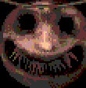

<h1 align="center">Buckshot Roulette</h1>

  <b>Buckshot Roulette for the NumWorks N0120 calculator.</b> 
  You, the Dealer, and a shotgun loaded in a hidden order.

  <a href="https://github.com/Mason363/NumPlay/releases/latest/download/BuckshotRoulette.nwa"><b>Download BuckshotRoulette.nwa</b></a>
  &nbsp;·&nbsp; <a href="#controls">Controls</a>

  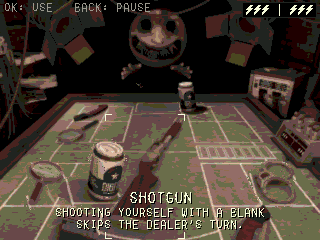

## Highlights

* **The whole game:** wake up in the bathroom, walk to the club's back room, sign the waiver and face the Dealer over three rounds. Lose in round 1 or 2 and the defibrillator brings you back. Lose in round 3 and you are dead.
* **Every item:** hand saw, magnifying glass, beer, cigarettes and handcuffs, plus the burner phone, inverter, adrenaline and expired medicine in Double or Nothing.
* **The real rules:** the same loads, charges, item limits and wire cuts as the original, and a Dealer who decides the way he does there.
* **Double or Nothing:** pop the pills after beating the game once. Keep doubling your winnings or walk away. Your best run is kept.
* **The original's look:** every picture is rendered from the game's own scenes, with its dithered, low-color style. The Dealer looms over the table, and every item he or you use plays out with the game's own animations, down to him turning the barrel on you.
* **Pick up where you left off:** quit at any time and continue the same turn later. What is done is done: quitting in the middle of a shot never takes it back.

<table>
  <tr>
    <td align="center">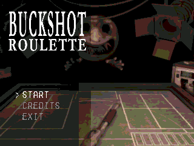 Title</td>
    <td align="center">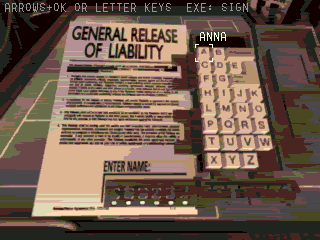 Please sign the waiver</td>
  </tr>
  <tr>
    <td align="center">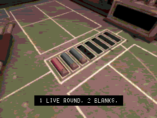 The shells of each load, shown before they go in</td>
    <td align="center">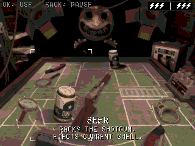 Your items, his, and both sides' charges at the top</td>
  </tr>
  <tr>
    <td align="center">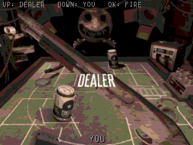 Up for the Dealer, Down for yourself</td>
    <td align="center">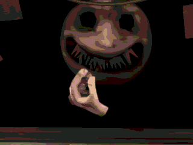 His turn: the barrel turned on you</td>
  </tr>
  <tr>
    <td align="center">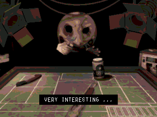 Every item he uses, as in the game</td>
    <td align="center">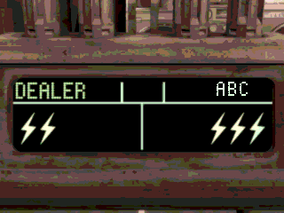 The charge display</td>
  </tr>
  <tr>
    <td align="center">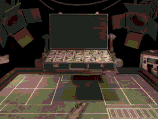 Win, and the cash comes down onto the table</td>
    <td align="center">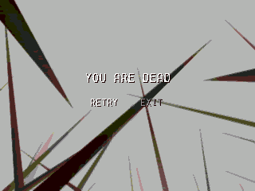 Lose the final round and it is over</td>
  </tr>
</table>

## How to play

The shotgun holds a mix of live (red) and blank (blue) shells, loaded in a hidden order. On your turn, use as many items as you like, then take the shotgun and shoot the Dealer or yourself. A live shell costs a charge. Shooting yourself with a blank keeps your turn. Whoever runs out of charges loses the round.

In round 3 the defibrillators are cut once you are down to your last charges: no more healing, and the next hit is fatal.

## Controls

| Key | Action |
|---|---|
| Arrows | Move between your items and the shotgun; go up to the Dealer's items to read them |
| OK or EXE | Use the item, pick up the shotgun, fire |
| Up / Down | With the shotgun: aim at the Dealer / at yourself |
| Letter keys (with or without Alpha) or arrows | Type your name on the waiver (EXE signs) |
| Back | Pause menu (resume, or back to the main menu) |
| Home | Save and quit |

## Credits

Inspired by Buckshot Roulette by Mike Klubnika. Not affiliated with Mike Klubnika or Critical Reflex.

* Every picture is rendered from Buckshot Roulette's own scenes, models and textures, which are the work of Mike Klubnika, through the Open Buckshot Roulette project (1503Dev).
* Fonts: Fake Receipt by Ray Larabie (Typodermic Fonts) and Dot Matrix by Dionaea.

Made by Mason Chen as part of NumPlay.
