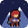
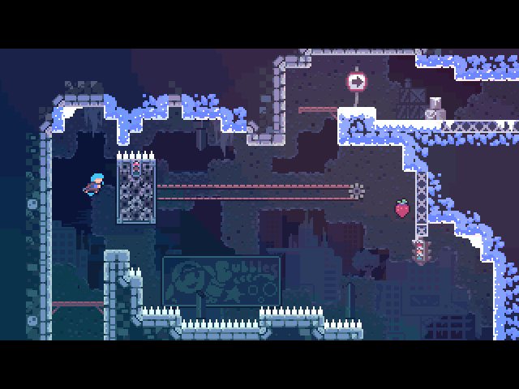
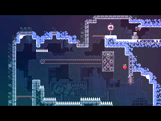
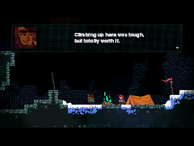
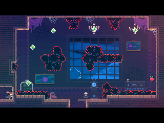
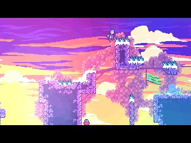
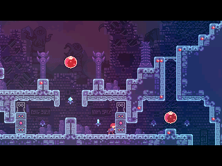
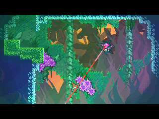
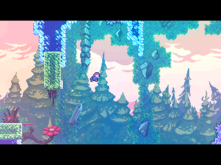
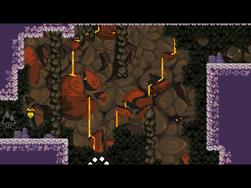

> **Celeste is a [NumPlay](../../README.md) game that comes on its own.** It fills the calculator's whole app space, so it can't sit next to NumPlay. Get `Celeste.nwa` from the [latest release](https://github.com/Mason363/NumPlay/releases/latest).

  

<h1 align="center">Celeste</h1>

  <b>Climb Celeste Mountain with Madeline, on the NumWorks calculator.</b> 
  The Prologue, all eight chapters, the Epilogue, and every B-side and C-side.

  <a href="https://github.com/Mason363/NumPlay/releases/latest/download/Celeste.nwa"><b>Download Celeste.nwa</b></a>
  &nbsp;·&nbsp; <a href="#controls">Controls</a>

  

## Highlights

* **The whole climb:** the Prologue, Forsaken City, Old Site, Celestial Resort, Golden Ridge, Mirror Temple, Reflection, The Summit, the Epilogue and Core, with all their rooms, B-sides and C-sides.
* **Madeline moves like in the game:** the same jumps, dashes, climbing and wall jumps, down to the frame.
* **The story:** every conversation with Theo, Granny, Oshiro and Badeline, with their portraits, and the scenes between, from the campfires to the hug in Reflection.
* **Everything to find:** strawberries, golden strawberries, crystal hearts with their poems, cassettes that unlock the B-sides, the Summit's gems.
* **The game's look:** its rooms, decorations and backgrounds, from dust bunnies and dream blocks to the Summit's wind, the mountain behind the chapter select and the picture at the end of each chapter.
* **Saved as you go:** Home saves and quits, and Climb then offers Continue. Your progress is also copied into `celeste_saves.py`, so installing the app again doesn't erase it.

<table>
  <tr>
    <td align="center"> Forsaken City</td>
    <td align="center"> Old Site: a night at the camp with Theo</td>
  </tr>
  <tr>
    <td align="center"> The Celestial Resort and its dust bunnies</td>
    <td align="center"> Golden Ridge</td>
  </tr>
  <tr>
    <td align="center"> Mirror Temple</td>
    <td align="center"> Reflection: Badeline fights back</td>
  </tr>
  <tr>
    <td align="center"> The Summit</td>
    <td align="center"> Core</td>
  </tr>
</table>

## How to play

Choose Climb, then a chapter, then Start. Each chapter is a series of rooms: get Madeline to the next one. She can dash once in the air (twice later on), and grab and climb walls until she gets tired. A death sends her back to the start of the room.

⌫ pauses: from there you can skip a scene, retry the room, restart the chapter, change the options, save and quit, or go back to the chapter select.

## Controls

| Key | What it does |
| --- | --- |
| Arrows | Move, and aim the dash |
| OK | Jump |
| Back | Dash, and talk |
| Toolbox | Grab, climb |
| ⌫ | Pause |
| Home | Save and quit |

In menus, OK or EXE confirms and Back goes back. You can change the keys in Options, then Keyboard Config. The game shows these keys the first time you open it, and again from Options, then Key Sheet.

## Good to know

* **One app at a time:** Celeste takes all the room the calculator has for apps. Installing it from the NumWorks website swaps out NumPlay and the other apps, and installing NumPlay again swaps it back out. Your progress in each one is kept.
* **No music:** the calculator has no speaker.
* **A few effects are simpler:** some glows, color filters and screen distortions are left out, the Epilogue's last picture and the chapters' end pictures are shown at half size, and the mountain doesn't turn: it fades from one view to the next.
* **Farewell isn't here:** the free chapter added after the game's release doesn't fit.
* **Reporting a bug:** turn on Options, then Room Code, and the corner of the screen shows which room you are in.
* **The game's cheat code works:** in the Prologue, walk left from the start into the hidden room, then press left, right, var, toolbox, up, up, down, left, toolbox and OK (toolbox is the grab key: use yours if you changed it). Every chapter opens with all its checkpoints, B-sides and C-sides, and the chapter panel gets a Room list to start anywhere.

## Credits

Inspired by Celeste, not affiliated with Maddy Makes Games.

* The pictures, animations, maps, texts and fonts come from the game's own files.
* Thanks to **reversal_lava63**, a beta tester who plays NumPlay's apps on a real calculator and reports what's wrong.

Made by Mason Chen as part of NumPlay.

## License

The game's code is licensed under the GNU General Public License v3.0: see the `LICENSE` file at the root of the repository. The game's pictures, animations, maps, texts and fonts keep their own terms (see Credits).
