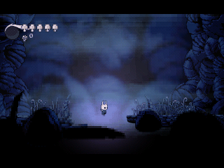
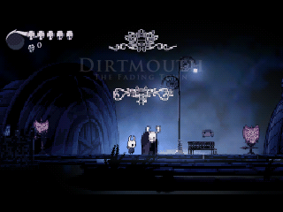
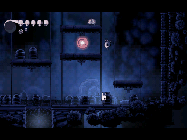
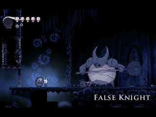
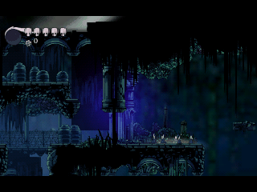
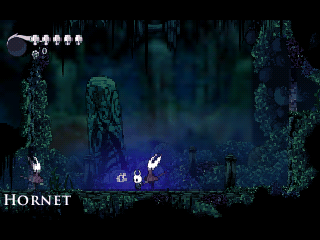
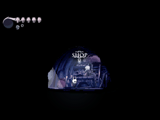
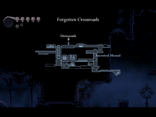

> **Hollow Knight is a [NumPlay](../../README.md) game that comes on its own.** It fills the calculator's whole app space, so it can't sit next to NumPlay. Get `HollowKnight.nwa` from the [latest release](https://github.com/Mason363/NumPlay/releases/latest).

  

<h1 align="center">Hollow Knight</h1>

  <b>Explore Hallownest as the Knight, on the NumWorks calculator.</b> 
  From King's Pass and Dirtmouth, through the Forgotten Crossroads, to Hornet in Greenpath.

  <a href="https://github.com/Mason363/NumPlay/releases/latest/download/HollowKnight.nwa"><b>Download HollowKnight.nwa</b></a>
  &nbsp;·&nbsp; <a href="#controls">Controls</a>

## Highlights

* **The start of the journey:** King's Pass, Dirtmouth, the Forgotten Crossroads with the False Knight, Gruz Mother and the Ancestral Mound, then Greenpath up to Hornet and the Mothwing Cloak, with the rooms along the way and their secrets.
* **The Knight moves like in the game:** the same jumps, nail slashes, recoils, pogos, dash, focus and Vengeful Spirit.
* **Its creatures and bosses:** from Crawlids and Vengeflies to Moss Knights and Mosskin, the False Knight, Gruz Mother and Hornet, each with its own attacks.
* **The people of Hallownest:** Elderbug, Sly, Iselda, Cornifer, Salubra, the Snail Shaman, Quirrel, Tiso, the Stag and the Grubfather, with all they have to say.
* **Everything to find and spend:** geo, charms and what they do, mask shards, vessel fragments, grubs, relics, the map, the quill and its markers, the stag stations and the shops.
* **Saved like in the game:** rest at a bench to save; die and your shade waits where you fell. Your saves are also copied into `hollowknight_saves.py`, so installing the app again doesn't erase them.

<table>
  <tr>
    <td align="center"> King's Pass</td>
    <td align="center"> Dirtmouth and Elderbug</td>
  </tr>
  <tr>
    <td align="center"> The Forgotten Crossroads</td>
    <td align="center"> The False Knight</td>
  </tr>
  <tr>
    <td align="center"> Greenpath</td>
    <td align="center"> Hornet</td>
  </tr>
  <tr>
    <td align="center"> Iselda's map shop</td>
    <td align="center"> The quick map</td>
  </tr>
</table>

## How to play

Choose Start Game, then a save. A new game first shows how to play: which key does what, then the basics. You can see them again with How to Play, on the title screen and in the pause menu. Then the Knight falls into King's Pass. Walk on to Dirtmouth and down the well into the Forgotten Crossroads.

Hit enemies with the nail to fill your soul, then hold the spell key to focus it into health. Rest at benches to save and to change charms. When you die you lose your geo and leave a shade behind: defeat it to get them back.

⌫ pauses: from there you can go on or quit to the title screen, which saves.

## Controls

| Key | What it does |
| --- | --- |
| Arrows | Move, look up and down, aim the nail up or down |
| Up | Talk, read, rest at a bench, go through a door |
| OK | Jump |
| Back | Nail |
| Shift | Dash, once you have the Mothwing Cloak |
| Alpha | Hold to focus and heal, tap to cast a spell |
| Var | Hold for the quick map |
| Toolbox | Inventory |
| ⌫ | Pause |
| Home | Save and quit |

In menus, OK or EXE confirms and Back goes back. In the inventory, left and right at the edges change pages. On the map page, OK places markers once you have them, and Shift shows or hides the key and the pins.

## Good to know

* **One app at a time:** Hollow Knight takes all the room the calculator has for apps. Installing it from the NumWorks website swaps out NumPlay and the other apps, and installing NumPlay again swaps it back out. Your saves in each one are kept.
* **Only the start of the game:** it ends with Hornet in Greenpath. The ways on to places further in stay shut, like Jiji's door, the lift down to the mines and the Dream Nail's paths.
* **No music or sound:** the calculator has no speaker.
* **A few things are simpler:** dust, sparks and other particles are left out, and characters and scenery are drawn a little less finely so the whole game fits.
* **Busy rooms stay smooth:** when the calculator falls behind, the room is drawn at half the height, each line shown twice. The HUD, text and menus stay sharp.

## Credits

Inspired by Hollow Knight, not affiliated with Team Cherry.

* The pictures, animations, maps, texts and fonts come from the game's own files.

Made by Mason Chen as part of NumPlay.

## License

The game's code is licensed under the GNU General Public License v3.0: see the `LICENSE` file at the root of the repository. The game's pictures, animations, maps, texts and fonts keep their own terms (see Credits).
