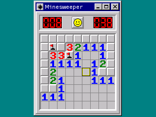

# Minesweeper

The Windows classic for the NumWorks calculator: the gray field, the red LED counters and the smiley, on the teal desktop.

- **Beginner** (9 x 9, 10 mines), **Intermediate** (16 x 16, 40) and **Expert** (30 x 16, 99), or a **Custom** field up to 30 x 16. Every size fits the screen whole.
- **Your first square is always safe** and opens an area.
- **No guessing** (in Options): every field you get can be cleared by logic alone, so a loss is always your mistake, never bad luck. (Very crowded custom fields are the exception: after a second of looking, you get a normal one.)
- **Marks (?)** like the original, if you want them.
- Best times and games won for each level, and your game is kept when you leave, to finish later. Starting another field doesn't lose it until you open that field's first square.

Open a number whose mines are all flagged to open everything around it at once, like clicking both buttons on Windows; hold OK on a number to see the squares around it pressed down. The cursor wraps around the edges.

## Controls

| Key | Action |
| --- | --- |
| Arrows, or 8 4 6 2 | Move |
| OK, EXE or 5 | Open (on a number: open around it; hold to see around it) |
| ⌫, Shift or 0 | Flag |
| Back | Pause: Resume, New game, Help, Quit game |

After a game, OK starts the next one, like clicking the smiley.

## Credits

Minesweeper was written by Robert Donner and Curt Johnson for Microsoft Windows (1990). This version was made from scratch for NumPlay, after the look of the Windows 95 game.

It comes inside [NumPlay](https://github.com/Mason363/NumPlay), or on its own as `Minesweeper.nwa` from the [latest release](https://github.com/Mason363/NumPlay/releases/latest).

Build: `make` (needs `arm-none-eabi-gcc` and Node.js for nwlink).
