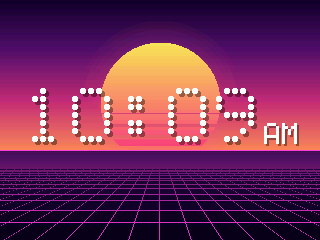

# NumVisuals

Moving backgrounds for the NumWorks calculator, with something on top: a clock, a stopwatch, a timer, a counter or your own words.

- **11 backgrounds:** Aurora, Sunset Drive, Plasma, Pastel, Lava Lamp, Warp, Tunnel, Fire, Ocean, Bokeh and Code Rain.
- **5 add-ons:** a clock you set, a stopwatch, a timer, a counter, and a line of text.

Pick a background with **Left / Right** and press **OK**, then pick an add-on the same way. **Back** goes one step back. Your choices, the clock, the timers and the counter are kept for next time.

Every background is drawn from a few formulas as it goes, and all the text uses one tiny font, so the app is only a few kilobytes.

It comes inside [NumPlay](https://github.com/Mason363/NumPlay), or on its own as `NumVisuals.nwa` from the [latest release](https://github.com/Mason363/NumPlay/releases/latest).

Build: `make` (needs `arm-none-eabi-gcc` and Node.js for nwlink).
