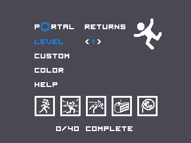
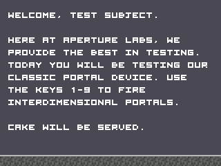
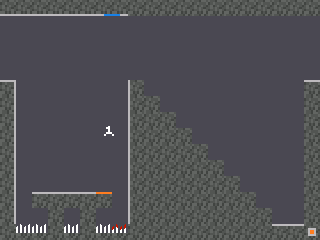
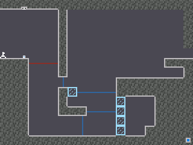
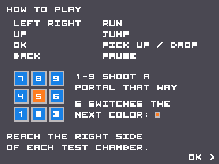
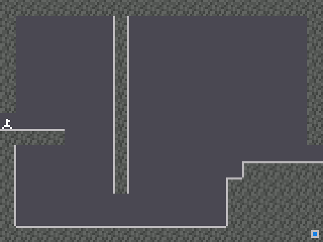

> **Portal Returns is part of [NumPlay](../../README.md)**, every NumWorks game in one app. Get it with all the others, or on its own as `PortalReturns.nwa` from the [latest release](https://github.com/Mason363/NumPlay/releases/latest).

<p align="center">
  
</p>

<h1 align="center">Portal Returns</h1>

<p align="center">
  <b>The TI-84 Plus CE classic, on the NumWorks N0120.</b><br>
  78 test chambers, the original art and the original physics, in about 35 KB.
</p>

<p align="center">
  <a href="https://github.com/Mason363/NumPlay/releases/latest"></a>
  
</p>

<p align="center">
  <a href="https://github.com/Mason363/NumPlay/releases/latest/download/PortalReturns.nwa"><b>Download PortalReturns.nwa</b></a>
  &nbsp;·&nbsp; <a href="#controls">Controls</a>
  &nbsp;·&nbsp; <a href="#install">Install</a>
  &nbsp;·&nbsp; <a href="#credits">Credits</a>
</p>

<p align="center">
  
</p>

## Highlights

* **All 78 chambers:** the 40 test chambers of Portal Returns, plus the 38 Portal Prelude chambers under Custom.
* **Just like on the TI:** same tiles, sprites, menus, GLaDOS messages and colors. The player, cubes and energy pellets move exactly as in the original, frame for frame.
* **Speedy thing goes in, speedy thing comes out:** momentum carries through portals, for you and for cubes.
* **Everything is here:** cubes, buttons and doors, fizzlers, electric fields, spikes, glass, energy pellets and receivers, the four color schemes and the ending.
* **New to Portal?** A short How to play guide sits in the menu, and small signs explain each new thing the first time you meet it.
* **Your progress is saved:** finished chambers get a check mark, and you pick up where you left off.

<table>
  <tr>
    <td align="center"><br><sub>Title screen and chamber select</sub></td>
    <td align="center"><br><sub>A word from the facility before each chamber</sub></td>
  </tr>
  <tr>
    <td align="center"><br><sub>Blue and orange portals</sub></td>
    <td align="center"><br><sub>Fizzlers, electric fields, glass and a cube</sub></td>
  </tr>
  <tr>
    <td align="center"><br><sub>How to play</sub></td>
    <td align="center"><br><sub>Chamber 2: portals keep your speed</sub></td>
  </tr>
</table>

## Controls

The number pad works like on the TI: each key fires a portal in its direction.

| Key | Action |
|---|---|
| Left, Right | Run |
| Up | Jump |
| 1 to 9 (not 5) | Fire a portal that way (7 is up left, 3 is down right...) |
| 5 | Switch the color of the next portal (shown in the lower right corner) |
| OK or EXE | Pick up or drop a cube, continue |
| Alpha | Show a message faster |
| Back | Pause (return, restart the chamber or quit) |
| Home | Save and quit |

## Install

1. Download **[PortalReturns.nwa](https://github.com/Mason363/NumPlay/releases/latest/download/PortalReturns.nwa)** from the [latest NumPlay release](https://github.com/Mason363/NumPlay/releases/latest).
2. Plug the calculator into your computer and open **[my.numworks.com/apps](https://my.numworks.com/apps)** in Chrome or Edge.
3. Upload `PortalReturns.nwa`. **Portal** appears at the end of the calculator's home screen.

## Credits

Inspired by [Portal Returns](https://www.cemetech.net/downloads/files/1313/x1313) by MateoConLechuga for the TI-84 Plus CE, and by Portal by Valve. Not affiliated with MateoConLechuga or Valve.

* Test chambers and messages: MateoConLechuga
* Sprites and tiles: CKH4
* Portal Prelude chambers: ported by Unicorn from BuilderBoy's Portal Prelude

Made by Mason Chen as part of NumPlay.

## Build

Requirements: the ARM embedded toolchain (`arm-none-eabi-gcc`) and Node.js, which `make` uses to fetch NumWorks' `nwlink` SDK.

```sh
make          # output/portal.nwa
make check    # link it the way the calculator does and print the installed size
make run      # install on a connected calculator
```
