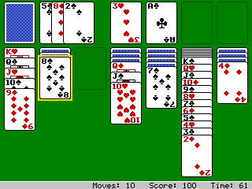

# Solitaire

Klondike for the NumWorks calculator, the way Google Solitaire (the game you get when you search for "solitaire") looks and plays: the deck and the waste on the left, the four foundations marked with their suits on the right, the dark bar with the time, score and moves, flat cards with two-tone suits and blue sunburst backs, and a red king for Easy or a blue king for Hard.

- **Choose your difficulty,** like Google's: **Easy** draws one card, **Hard** draws three.
- **Undo and New** under the deck, as in Google's game, plus a Hint, OK twice to send a card up, a key that plays everything it can to the foundations, and an automatic finish once every card is face up.
- **More than Google's:** Standard, Vegas or no scoring (Vegas starts at -$52, pays $5 a card and limits the passes through the deck; **Keep score** adds your Vegas games up), a timed game (lose 2 points every 10 seconds in Standard, and a bonus for a fast win), four card backs, and the famous ending where the cards bounce off the bottom of the screen.
- **Saved as you go:** leave in the middle of a game and continue it later. Statistics count your games, wins, streaks, best time, best score and your Vegas bank.

Every card is drawn as it goes: suits from tiny bitmaps, court figures from a few shapes, and only what changes is redrawn.

## Controls

| Key | Action |
| --- | --- |
| Left, Right | Move across: the deck, the seven columns, the foundations |
| Up, Down | Pick up more or fewer cards in a column; move in the side columns (deck, waste, Undo, New; the foundations) |
| OK | Pick up, put down (on the deck: draw; on Undo, New: press) |
| OK twice | Send the card to its foundation |
| EXE | Draw from the deck |
| Toolbox | Play all you can to the foundations |
| ⌫ | Undo |
| Shift | Hint |
| Back | Put the cards back, or pause |

When you put a run down, the game finds how many cards fit there.

## Scoring

| Move | Standard | Vegas |
| --- | --- | --- |
| To a foundation | +10 | +$5 |
| Waste to a column | +5 | |
| Turning a card over | +5 | |
| Foundation back to a column | -15 | -$5 |
| Recycling the deck | -100 (Easy), -20 after 3 passes | not after the last pass |

## Credits

The look follows **Google Solitaire** (Google Search, 2016 onwards). This is an independent fan version, drawn from shapes (no images from Google), and it isn't affiliated with or endorsed by Google.

It is written in C for NumPlay, inspired by Tatone26's Solitaire in [Numworks-games](https://github.com/Tatone26/Numworks-games/tree/main/apps/solitaire) (All the Apps), with no code copied from it. It keeps that version's Difficulty option (how many cards you draw) and adds the deal and win animations, the scoring, the clock, Undo, Hint, the automatic finish and statistics. The scoring and the bouncing cards come from Microsoft's Windows Solitaire (Wes Cherry).

It comes inside [NumPlay](https://github.com/Mason363/NumPlay), or on its own as `Solitaire.nwa` from the [latest release](https://github.com/Mason363/NumPlay/releases/latest).

Build: `make` (needs `arm-none-eabi-gcc` and Node.js for nwlink).
